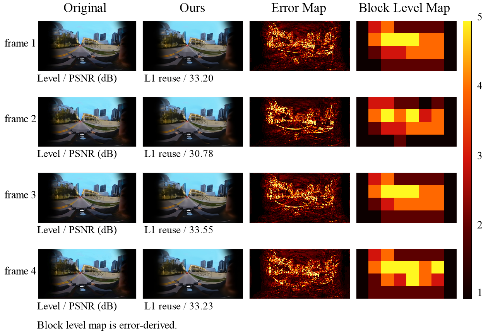

# Network-Oriented Evaluation of Semantic XR Video Transmission

This repository accompanies an academic study on semantic video transmission for extended reality (XR). The project investigates whether an AI-aided video stream can expose explicit frame-level update units that are useful for future wireless and XR transport mechanisms.

The current prototype is not presented as a replacement for mature video codecs such as H.264 or VP9. Instead, it is used as an experimental platform for studying a different question: how does a semantic video stream behave when complete frame updates are delayed, unavailable, or intentionally skipped at the application layer?

## Research Motivation

XR video transmission is constrained by bandwidth, latency, responsiveness, and visual continuity. Traditional codecs are highly optimized for rate-distortion efficiency, but their internal prediction structures are not directly exposed as semantic network-control units. Semantic communication suggests a complementary design direction: the transmitted stream may carry only the updates needed to preserve meaning, task relevance, or receiver state.

This project evaluates that direction with a modular prototype built from pretrained vision components. The stream separates frames into:

- **reuse events**, where the receiver displays a cached reconstruction;
- **full latent updates**, where a compressed VAE latent refreshes the receiver state;
- **residual latent updates**, where only the latent difference from the previous receiver-side state is transmitted.

This event-level representation allows the stream to be evaluated not only by average bitrate, but also by update availability, dependency structure, fallback behaviour, and quality under frame-level update loss.

## System Overview

The prototype combines five main mechanisms:


*Semantic XR transmission pipeline. The sender selects between semantic reuse, full latent updates, and residual latent updates. The receiver maintains cached visual and latent states that can be reused or refreshed depending on the received event.*

1. **CLIP-based semantic reuse**
   Consecutive frames are compared using CLIP image embeddings. If the semantic similarity is high enough, the frame is assigned to a reuse event and no visual latent payload is transmitted.

2. **VAE latent transmission**
   Non-reused frames are represented in compressed latent space rather than as raw RGB frames.

3. **Latent residual coding (LRC)**
   For temporally similar Level 2 frames, the sender transmits a residual latent instead of a full latent tensor. This reduces the prototype's own visual payload while preserving a synchronized receiver-side latent state.

4. **Latitude-adaptive quantization (LAQ)**
   For equirectangular panoramic video, the prototype reduces precision near polar regions and preserves more precision near the equator, reflecting the non-uniform spherical area represented by ERP pixels.

5. **Receiver-side SwinIR restoration**
   After VAE decoding, SwinIR is applied locally at the receiver to reduce reconstruction artifacts. This stage does not add transmitted visual payload.

## Evaluation Scope

The repository supports experiments on:

- visual payload reduction from LRC and LAQ;
- quality-payload operating points for conventional and panoramic video;
- comparison with H.264 and VP9 under no-loss rate-distortion metrics;
- frame-level update loss using shared binary loss masks;
- previous-state fallback behaviour when updates are unavailable.

The frame-level loss model is an application-layer abstraction. It removes complete frame updates instead of simulating raw packet loss, packet reordering, or wireless interference. This matches the paper's focus on deadline-driven media behaviour: an update that arrives too late may be unusable even if a reliable transport eventually delivers it.

## Key Findings

The experiments lead to a conservative interpretation:



*Qualitative VR reconstruction examples showing original frames, reconstructed frames, error maps, and block-level error maps.*

- LRC and LAQ reduce the prototype's own visual payload, especially on the tested panoramic sequence.
- The optimized semantic stream remains less efficient than mature codecs in classical rate-distortion terms.
- H.264 remains stronger under the reported frame-level loss comparison.
- The main value of the architecture is therefore not immediate codec replacement. Its value is that it exposes reuse, full-update, and residual-update events that future network mechanisms could prioritize, protect, retransmit, or skip.

## Repository Layout

```text
src/
  Ninth_drift.py
    Two-level semantic video prototype using CLIP, VAE latents, and SwinIR.

  Tenth_drift.py
    Enhanced prototype with latent residual coding and latitude-adaptive
    quantization for panoramic video.

scripts/
  generate_packet_loss_videos.py
    Generates frame-level update loss videos with shared loss masks.

  compute_packet_loss_quality.py
    Computes PSNR and SSIM for generated loss videos.

  compute_packet_loss_all_metrics.py
    Extended metric computation script for loss outputs.

paper/
  MSWiM2026_paper.tex
  bibliography.bib
  Figures/
    LaTeX source and figures for the conference paper draft.

results/
  masks/
    Frame-level loss masks used in the robustness experiments.

  summaries/
    CSV summaries of generated loss videos.

  ninth_tenth_*_comparison.json
    Comparison outputs for prototype variants.
```

Large video files, model checkpoints, generated PDFs, LaTeX temporary files, and local build artifacts are intentionally excluded from the repository.

## Requirements

The prototype scripts were developed in a Python research environment with GPU support. Core dependencies include:

- Python 3.8+
- PyTorch
- NumPy
- OpenCV
- Pillow
- scikit-image
- ffmpeg and ffprobe available on `PATH`
- optional: `zstandard`

Install the lightweight Python dependencies with:

```bash
pip install -r requirements.txt
```

The main prototype scripts expect local pretrained resources. Before running in a new environment, update the following constants in `src/Ninth_drift.py` and `src/Tenth_drift.py`:

- `PROJECT_ROOT`
- `SWINIR_ROOT`
- `VAE_PATH`
- `SWINIR_PATH`

These paths are environment-specific and are not bundled in this repository.

## Example Usage

Generate frame-level update loss videos:

```bash
python scripts/generate_packet_loss_videos.py \
  --dataset vr \
  --methods ours=Tenth_drift_vr_15_output.mp4 h264=vr_h264_200k.mp4 vp9=vr_vp9_200k.mp4 \
  --loss-rates 0 10 20 30 \
  --seed 42
```

Compute PSNR and SSIM for generated loss videos:

```bash
python scripts/compute_packet_loss_quality.py \
  --root /path/to/experiment/root
```

Compile the paper:

```bash
cd paper
pdflatex -interaction=nonstopmode MSWiM2026_paper.tex
bibtex MSWiM2026_paper
pdflatex -interaction=nonstopmode MSWiM2026_paper.tex
pdflatex -interaction=nonstopmode MSWiM2026_paper.tex
```

## Reproducibility Notes

The repository includes masks and summary files, but not the original and generated video files because they are large and partly derived from external public video sources. To reproduce the full experiments, prepare the source videos and codec baselines locally, then run the scripts using the same loss masks in `results/masks/`.

The reported payload values in the paper are visual payloads only. They do not include audio, container metadata, frame descriptors, or deployable protocol headers. The reported frame-level loss results should therefore be read as diagnostic evidence about stream structure, not as a complete wireless network simulation.

## Citation

If you use this repository, please cite the accompanying paper once the final bibliographic information is available. For now, the working title is:

```text
Network-Oriented Evaluation of Semantic XR Video Transmission under Frame-Level Update Loss
```

## License

No license has been selected yet. Please contact the authors before reusing the code or paper materials beyond academic review and discussion.
